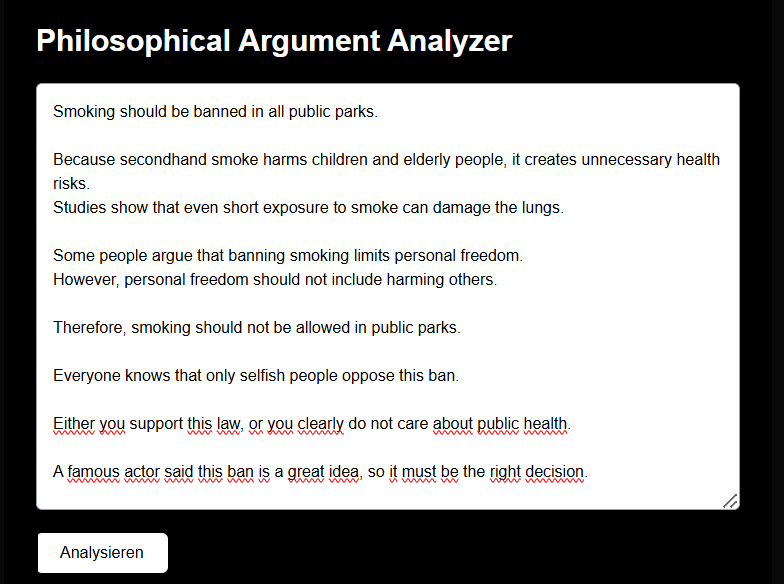
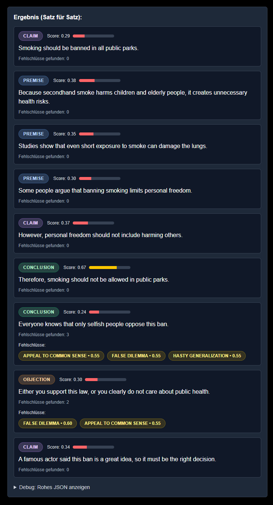
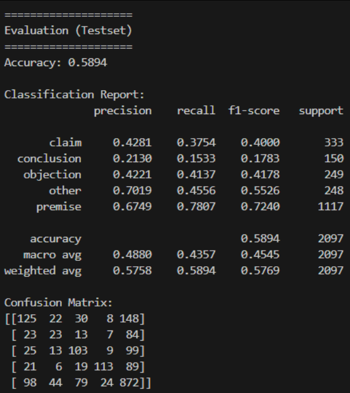

# Philosophical Argument Analyzer

Erstellt am: 01.03.2026  
Status: Forschungs- / Demo-System

Der Philosophical Argument Analyzer ist ein NLP-System auf Satzebene,
das argumentative Rollen in Online-Diskussionen automatisch
klassifiziert und zusätzlich mögliche Fehlschlüsse heuristisch markiert.

Ziel des Projekts ist es, klassische ML-Pipelines mit
einer modernen Web-Architektur zu kombinieren, um strukturierte
Argumentanalyse umzusetzen.

------------------------------------------------------------------------

# ÜBERBLICK

Das System analysiert eingegebenen Text und:

- Klassifiziert jeden Satz als: `claim`, `premise`, `objection`, `conclusion` oder `other`
- Markiert potenziell logische Fehlschlüsse (heuristikbasiert)
- Visualisiert die Ergebnisse in einer Next.js-Weboberfläche

Wichtig: Die Fehlschluss-Erkennung ist heuristikbasiert und dient nur zu
Demonstrationszwecken. Sie stellt kein formales logisches Beweissystem
dar.

------------------------------------------------------------------------

# KERN-MACHINE-LEARNING-FEATURE

Sentence-Level Argumentrollen-Klassifikation.

Modellaufbau:
- TF-IDF Feature-Extraktion
- Logistic Regression / Linear SVM
- GridSearch zur Modellauswahl
- Strikte Train/Test-Trennung

------------------------------------------------------------------------

# STACK

Backend:
- FastAPI
- scikit-learn
- pandas
- numpy
- joblib

Frontend:
- Next.js (React)
- TypeScript
- TailwindCSS

Machine Learning:
- TF-IDF Vektorisierung
- Logistic Regression
- Linear SVM
- GridSearchCV

------------------------------------------------------------------------

# PROJEKTSTRUKTUR

`backend/main.py`  
FastAPI-Server und Analyse-Pipeline

`backend/fallacy_detector.py`  
Heuristische Fehlschluss-Erkennung

`backend/ml/train_role_model.py`  
Training, Evaluation und Speichern des Modells

`backend/ml/modeling.py`  
TF-IDF + Klassifikator-Suche

`frontend/app/page.tsx`  
UI für Texteingabe und Ergebnisdarstellung

------------------------------------------------------------------------

# BACKEND STARTEN

Vom Projekt-Root aus:

```powershell
.\.venv\Scripts\python.exe -m uvicorn backend.main:app --reload --host 127.0.0.1 --port 8000
```

API-Endpunkte:
- Root: `http://127.0.0.1:8000/`
- Health: `http://127.0.0.1:8000/health`
- Docs: `http://127.0.0.1:8000/docs`

------------------------------------------------------------------------

# FRONTEND STARTEN

```powershell
cd frontend
npm install
npm run dev
```

Dann im Browser öffnen: `http://127.0.0.1:3000`

------------------------------------------------------------------------

# MODELL TRAINIEREN

```powershell
.\.venv\Scripts\python.exe backend\ml\train_role_model.py
```

Das Skript:
- Baut `role_train.csv` aus Gold-Labels (menschlich gelabelte Sätze) neu auf
- Verwaltet ein fixes Testset (`role_test_fixed.csv`)
- Führt GridSearch durch
- Speichert Modell + Metadaten in `backend/models/`

------------------------------------------------------------------------

# DEMO

Frontend Input:



Frontend Output:



Model-Metriken:



------------------------------------------------------------------------

# BEISPIEL-METRIKEN (Testlauf)

- Accuracy: `0.5894`
- Macro F1: `0.4545`
- Weighted F1: `0.5769`
- Test Samples: `2097`

Beobachtungen:
- `premise` wird deutlich besser erkannt als `conclusion`
- Klassenungleichgewicht bleibt eine Herausforderung
- Accuracy allein reicht nicht zur Bewertung

------------------------------------------------------------------------

# ML-ENTSCHEIDUNGEN

1. Klassenungleichgewicht (Mehrheitsklasse dominiert)
   - Problem: Viele `premise`-Beispiele, deutlich weniger `conclusion`-Beispiele.
   - Lösung: Leichtes Oversampling nur im Train-Teil; Test-Teil bleibt unverändert.

2. Overfitting-/Leakage-Risiko zwischen Train und Test
   - Problem: Überschneidungen zwischen Train und Test führen zu künstlich guten Metriken.
   - Lösung: Strikte Disjoint-Prüfung über `source_row` und `thread_id` + fixes Testset `role_test_fixed.csv`.

3. Label-Inkonsistenz (Label-Noise)
   - Problem: Ähnliche Sätze wurden teilweise unterschiedlich gelabelt.
   - Lösung: Klare Gold-Label-Regeln und manuelle Korrekturen.

4. Einzelmetrik `accuracy` ist zu wenig
   - Problem: Gute Accuracy kann schwache Klassen verdecken.
   - Lösung: Immer zusätzlich `macro avg`, `weighted avg` und Klassen-F1 auswerten.

------------------------------------------------------------------------

# DISCLAIMER

Dieses Projekt ist ein Forschungs- und Demonstrationssystem.

- Fehlschluss-Erkennung ist heuristikbasiert.
- Ergebnisse sind Hinweise, keine endgültigen logischen Urteile.
- Performance hängt stark von der Trainingsdatenqualität ab.

------------------------------------------------------------------------

# LIZENZ / NUTZUNG

Dieses Projekt dient ausschließlich der Veranschaulichung (Demo-/Lernzwecke).

Alle Rechte vorbehalten.  
Ohne ausdrückliche schriftliche Genehmigung ist Kopieren, Veröffentlichen,
Weiterverbreiten oder kommerzielle Nutzung nicht gestattet.
